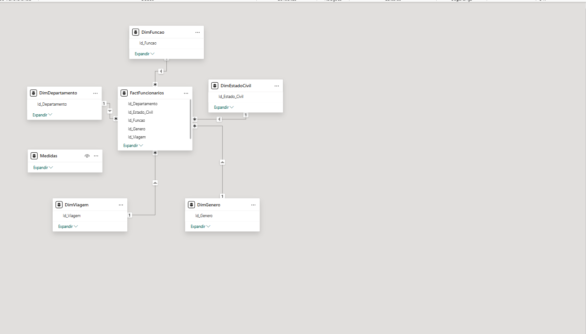

# 📊 Talent Wave – People Intelligence Dashboard

## 📌 Visão Geral do Projeto

O **Talent Wave – People Intelligence Dashboard** é um projeto completo de **People Analytics**, desenvolvido com o objetivo de apoiar decisões estratégicas de Recursos Humanos por meio de uma visão integrada sobre **performance, engajamento, promoção e desenvolvimento da força de trabalho**.

Este projeto foi concebido como um **produto analítico**, não apenas como um conjunto de gráficos, priorizando:

- Clareza visual  
- Consistência estética  
- Escalabilidade técnica  
- Governança de dados  
- Experiência do usuário final  

---

## 🧠 Objetivos do Dashboard

- Identificar riscos de performance organizacional  
- Apoiar decisões de promoção e desenvolvimento  
- Mapear gaps de capacitação  
- Monitorar saúde organizacional  
- Facilitar análises segmentadas por perfil de colaborador  

---

## 🏗️ Arquitetura Técnica

### 🔹 Tecnologias Utilizadas

| Camada | Tecnologia | Finalidade |
|--------|------------|------------|
| ETL | **Power Query (M)** | Extração, limpeza e transformação dos dados |
| Modelagem | **Modelo Estrela (Star Schema)** | Performance e governança |
| Medidas | **C# (Tabular Editor)** | Criação centralizada e padronizada de métricas |
| Visualização | **Power BI** | Interface analítica |
| Visual Customizado | **R** | Layouts executivos e visuais narrativos |
| Página Estática | **Python (Matplotlib)** | Páginas instrutivas e institucionais |
| Análise Exploratória | **Python (Pandas)** | Validação e entendimento dos dados |

---

## 🔄 Processo ETL (Extract, Transform, Load)

### 📥 Extração

- Dados extraídos a partir de arquivos **CSV**  
- Separação inicial entre dados **RAW**, **FACT** e **DIM**  

---

### 🧹 Tratamento da Tabela RAW

- Padronização de tipos  
- Remoção de duplicidades  
- Tratamento de valores nulos  
- Normalização de colunas categóricas  

---

### 🧱 Criação das Tabelas DIM

- `DimFuncionario`  
- `DimFuncao`  
- `DimDepartamento`  
- `DimGenero`  
- `DimEstadoCivil`  
- `DimViagem`  

Cada dimensão foi criada com:

- Chave substituta  
- Atributos descritivos  
- Granularidade única  

---

### 📊 Criação da Tabela FACT

- `FactFuncionarios`  
- Métricas numéricas e indicadores de performance  
- Relacionamentos 1:N com as dimensões  

---

## 🔗 Relacionamento dos Dados

- Modelo **Star Schema**  
- Relacionamentos unidirecionais  
- Chaves inteiras  
- Alta performance em consultas DAX  

---

## 📐 Criação das Medidas (C# – Tabular Editor)

Todas as medidas foram criadas de forma centralizada utilizando **C# no Tabular Editor**, garantindo:

- Padronização  
- Reutilização  
- Facilidade de manutenção  

Exemplos:

- Média de Performance  
- % Performance Crítica  
- % Performance Saudável  
- % Aptos à Promoção  
- Indicadores de Engajamento  

---

## 🎨 Identidade Visual e Paleta de Cores

### 🎯 Princípios de Design

- Leitura rápida  
- Contraste adequado  
- Hierarquia visual clara  
- Consistência entre páginas  

---

### 🎨 Paleta Principal

- Fundo: `#324E55` (30% de transparência)  
- Texto: Branco  
- Destaque: `#F2C94C`  
- Crítico: Vermelho  
- Saudável: Verde  

---

### 🔤 Tipografia

- Fonte padrão: **Verdana**  
- Títulos e KPIs com destaque  
- Legibilidade em telas grandes  

---

## 📊 Estrutura das Páginas

### 📌 People Overview

- Visão geral da força de trabalho  
- Indicadores demográficos  
- Engajamento e distribuição salarial  

---

### 📌 People Performance

- Análise de desempenho  
- Promoção recomendada  
- Saúde organizacional  

---

### 📌 Learning & Development

- Identificação de riscos  
- Heatmap de experiência x satisfação  
- Priorização de ações de capacitação  

---

### 📌 How to Use

- Página institucional e instrutiva  
- Criada em **Python**  
- Layout estático, elegante e narrativo  
- Sem dependência de dados  
- Sem HTML ou CSS  

---

## 🧪 Uso de Python (Pandas & Matplotlib)

- Validação e exploração dos dados  
- Criação de páginas estáticas  
- Controle total de layout  
- Tipografia e cores alinhadas ao dashboard  

---

## 📐 Uso de R para Visuais Customizados

- Heatmaps executivos  
- Layouts narrativos  
- Controle fino de tipografia  
- Eliminação de limitações visuais nativas do Power BI  

---

## 📚 Lições Aprendidas

- Power BI pode ser tratado como **plataforma de produto**  
- R e Python ampliam drasticamente o potencial visual  
- Separar dados RAW, FACT e DIM é essencial  
- Centralizar medidas melhora governança  
- Design é tão importante quanto análise  
- Menos gráficos, mais clareza  
- Narrativa visual gera mais valor que complexidade técnica  

---

## 🚀 Próximos Passos

- Automatização de insights  
- Integração com fontes externas  
- Versão mobile  
- Camada de storytelling avançado  
- Expansão para People Forecasting  

---

## 👤 Autor

**Lucas Motoso**  
People Analytics | Data Visualization | Business Intelligence  

---

> *Este projeto representa a convergência entre dados, design e decisão estratégica.*
